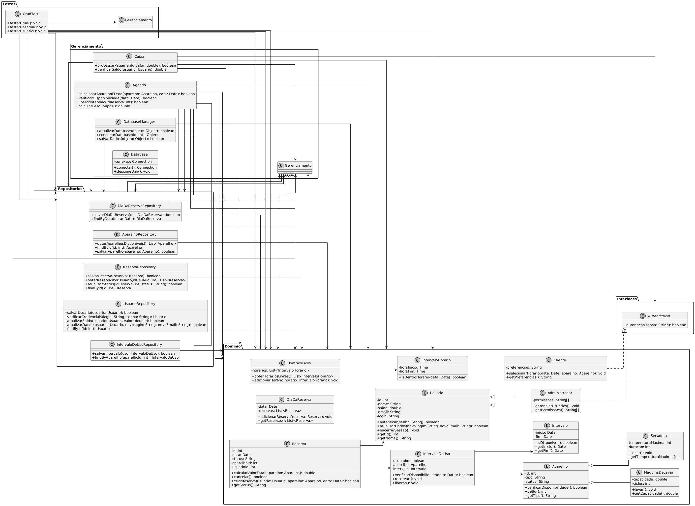
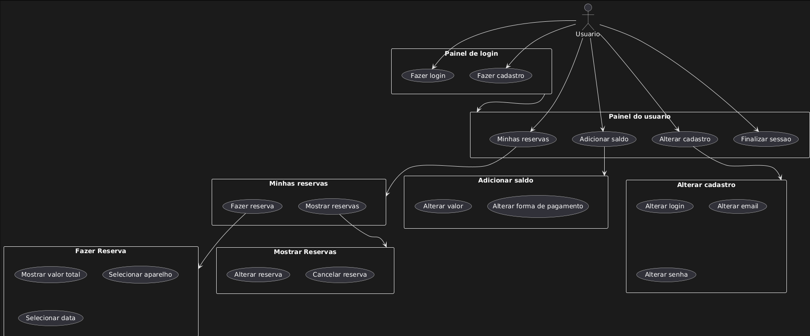

# grupo3
Repositório do grupo 3

## Membros 
* Daniel - @danielufg - Backend
* Eduardo - @Eddclement - Frontend
* João - @joao-araujo22 - Frontend
* José - @jjoseeee - Backend
* Miguel - @Miguel-MC-png - Backend

## Seção 1 - Introdução

### Justificativa
A crescente demanda por serviços de lavanderia exige soluções eficientes para otimizar o tempo de atendimento e a organização dos processos internos. Muitas lavanderias ainda utilizam métodos manuais ou sistemas pouco integrados, o que pode gerar atrasos, confusões e insatisfação dos clientes.

### Descrição do problema
Atualmente, a gestão do tempo em lavanderias é um desafio, principalmente no controle do status das roupas, prazos de entrega e organização das tarefas diárias. A falta de um sistema automatizado pode acarretar em perdas de produtividade, esquecimentos e dificuldade no acompanhamento dos pedidos.

### Motivação
A proposta deste projeto é desenvolver um sistema de gerenciamento de tempo para lavanderias, utilizando os princípios da programação orientada a objetos. O objetivo é facilitar o controle dos processos, melhorar a comunicação interna e garantir maior eficiência no atendimento ao cliente. A motivação principal é proporcionar uma solução tecnológica acessível, que contribua para a modernização e o crescimento do setor.

## Seção 2 - Plano

### Objetivo geral 
Desenvolver um sistema de gerenciamento de tempo para lavanderia, utilizando programação orientada a objetos, com foco em otimizar os processos internos, melhorar a eficiência operacional e garantir a entrega dos serviços dentro dos prazos estabelecidos

### Objetivos específicos
* Mapear e organizar os processos produtivos da lavanderia, identificando etapas críticas e possíveis gargalos.

* Automatizar o controle de entrada, processamento e saída das roupas, permitindo o acompanhamento em tempo real do status de cada pedido.

* Reduzir desperdícios de tempo e recursos, promovendo a melhor utilização dos equipamentos e da equipe.

* Propor e implementar melhorias nos fluxos de trabalho, visando aumentar a produtividade e a satisfação dos clientes.

* Disponibilizar relatórios gerenciais que auxiliem na tomada de decisão e no planejamento das atividades da lavanderia.

* Integrar funcionalidades que facilitem a comunicação entre funcionários e clientes, como notificações de status e previsão de entrega

## Seção 3 - Divisão de tarefas:

### Tarefas (issues)
O projeto foi dividido em tarefas menores para facilitar o desenvolvimento e garantir o acompanhamento do progresso. Entre as principais tarefas estão:

* Levantamento dos requisitos e definição das funcionalidades do sistema

* Modelagem das classes e estrutura do banco de dados

* Implementação das funcionalidades principais (cadastro de clientes, controle de pedidos, gestão de tempo, notificações)

* Criação da interface do usuário

* Testes e validação do sistema

* Documentação do projeto

### Atribuição de tarefa
A distribuição das tarefas foi realizada conforme as habilidades e interesses de cada membro do grupo, promovendo o engajamento e o desenvolvimento individual.

### Responsabilidades 
Eduardo: coordenação do grupo, acompanhamento do progresso, integração dos módulos e revisão final

Eduardo: levantamento de requisitos, documentação geral, testes e validação

José: modelagem das classes e banco de dados

Miguel: implementação das funcionalidades principais

Daniel: desenvolvimento da interface do usuário

João: desenvolvimento da interface do usuário

### Prazos
Cada tarefa foi associada a um prazo específico, definido em conjunto para garantir o cumprimento do cronograma geral do projeto. O acompanhamento dos prazos foi realizado por meio de reuniões semanais e atualizações regulares das tarefas, seguindo boas práticas de organização e divisão do trabalho em projetos de programação.

## Seção 4 - Modelagem inicial: 

### Diagrama de classes 
Diagrama Completo


Diagrama separado em duas partes para facilitar visualização


```java
@startuml
class User {
    ~ matricula: int    
    + setMatricula(matricula: int)    
}

class Agenda {
    # tempoDeFuncionamentoSemana: static double[]
    # HorarioMarcado: static []
    # nomeAgenda: String
    # tempoOfertadoAgenda: double[]
    # tempoPadrao: double
    + Agenda(){} : Construtor de agenda
    + Agenda(nome: String): setNomeAgenda(nome)    
    ~ marcarHorario(int dia, double inicioDoHorario, double fimDoHorario, int matricula, double pesoRoupa) : boolean
    ~ setNomeAgenda(nome: String)
}

abstract class MaquinaLavar {
    ~ pesoMax: int  
    ~ MaquinaDeLavar(int pesoMax)
    + lavar()
    + getPreco()
    + MaquinaLavar criarMaquina(int pesoRoupa)    
}

class MaquinaPequena{
    ~ MaquinaPequena()
    + lavar()
    + getPreco()
}

class MaquinaMedia{
     ~ MaquinaMedia()
    + lavar()
    + getPreco()
}

class MaquinaGrande{
    ~ MaquinaGrande()
    + lavar()
    + getPreco()
}

class Caixa {    
    + Cobrar(MaquinaLavar maquina, int matricula)    
}

class Sistema {
    ~ import java.util.Scanner;
    + public static void main(String[] args)
}

class Intervalo {
    # inicio : double
    # fim : double
    # tempoTotal : double
    # idMaquina : double
    + Intervalo() {}
    + Intervalo(double inicio, double fim)
    + Intervalo(String idMaquina, double inicio, double fim)
}

class HorarioMarcado extends Intervalo {
    #int matriculaDoUsuario
    #int dia
    #String idMaquina
    +HorarioMarcado(int dia, double inicioDoHorario, double fimDoHorario, int matricula)
    +double[] definirTempoMaquinaS(char tipoMaquina)
    +boolean selecionarDia(char tipoMaquina)
    +boolean indisponibilizarTempo(char tipoMaquina)
}
Agenda ..> User : Dependencia
MaquinaLavar <|-- MaquinaPequena : Herança
MaquinaLavar <|-- MaquinaMedia : Herança
MaquinaLavar <|-- MaquinaGrande : Herança
User -- Caixa : Usa >
Caixa ..> User : Dependência (int matricula)
Sistema..> User : Cria
Sistema..> Caixa : Cria
Sistema..> Agenda : Interage
Sistema..> MaquinaLavar : Cria
@enduml
````
### Diagramas de sequência


````
@startuml
actor Usuario
participant Maquina
participant Caixa

Usuario -> Sistema : login(nome, telefone)
Sistema --> Usuario : confirmação de login

Usuario -> Sistema : nRoupas
Sistema --> Caixa : calcPeso()
Caixa --> Usuario : valorTotal()
Sistema --> Maquina  : Modelo de Máquina
Sistema --> Usuario : Modelo de Máquina 
Maquina -> Sistema : iniciarLavagem()
Sistema --> Usuario : "Lavagem finalizada!"
@enduml
````
### Casos de uso


| Campo               | Descrição                                                                 |
|--------------------|---------------------------------------------------------------------------|
| **Nome**           | marcarHorario                                                             |
| **Ator Principal** | Cliente                                                                   |
| **Descrição**      | O estudante escolhe um horário para lavar suas roupas e reserva.           |
| **Pré-condições**  | O horário precisa estar livre.                                             |
| **Pós-condições**  | O horário fica reservado e indisponível.                                   |
| **Fluxo Principal**|                                                                           |
| 1. O sistema calcula o peso das roupas.                      |
| 2.  Pergunta ao usuário qual horário ele deseja, mostra as máquinas disponíveis e o estudante seleciona um horário.            |
| 3. O sistema verifica os horários disponíveis                                                   |
| 4. O sistema registra a reserva e confirma.                                                     |
| **Alternativas**   | 3a. Se o horário escolhido estiver ocupado, o sistema informa e cancela a operação.           |


  | Campo                  | Descrição                                                                                        |
  |--------------------    |--------------------------------------------------------------                                    |
  | **Nome**               | cobrar                                                                                           |
  | **Ator Principal**     |  Caixa                                                                                            |
  | **Descrição**          |Após o estudante usar as máquinas de lavar roupa, ele realiza o pagamento.                        |
  | **Pré-condições**      | O estudante precisa ter passado pelo processo de agendamento, lavagem e estar no momento da cobrança. |
  | **Pós-condições**      | A matrícula é registrada no sistema.    |
  | **Fluxo Principal**    |                                         |
  | 1.O estudante agenda um horário para lavar as roupas.                                     |
  | 2. O estudante lava suas roupas.                                                          |
  | 3. O sistema verifica qual tipo de máquina o estudante utilizou.                          |
  | 4. O sistema cobra o respectivo valor da máquina ao estudante.                            |
  | **Alternativas**    | nda                                                                 |


### Casos de Uso Específico



````java
@startuml

actor Usuario

rectangle "Painel de login" {
	usecase "Fazer login" as UC1
	usecase "Fazer cadastro" as UC2
}

rectangle "Painel do usuario" {
	usecase "Minhas reservas" as UC3
	usecase "Adicionar saldo" as UC4
	usecase "Alterar cadastro" as UC5
	usecase "Finalizar sessao" as UC6
}

rectangle "Alterar cadastro" {
	usecase "Alterar login" as UC13
	usecase "Alterar email" as UC14
	usecase "Alterar senha" as UC15
}

rectangle "Adicionar saldo" {
	usecase "Alterar valor" as UC16
	usecase "Alterar forma de pagamento" as UC17
}

rectangle "Minhas reservas" {
	usecase "Fazer reserva" as UC7
	usecase "Mostrar reservas" as UC8
}

rectangle "Fazer Reserva" {
	usecase "Mostrar valor total" as UC9
	usecase "Selecionar aparelho" as UC10
	usecase "Selecionar data" as UC11
}

rectangle "Mostrar Reservas" {
	usecase "Alterar reserva" as UC18
	usecase "Cancelar reserva" as UC12
}

"Painel de login" --> "Painel do usuario"
UC5 --> "Alterar cadastro"
UC3 --> "Minhas reservas"
UC7 --> "Fazer Reserva"
UC8 --> "Mostrar Reservas"
UC4 --> "Adicionar saldo"

Usuario --> UC1
Usuario --> UC2
Usuario --> UC3
Usuario --> UC4
Usuario --> UC5
Usuario --> UC6

@enduml
````

